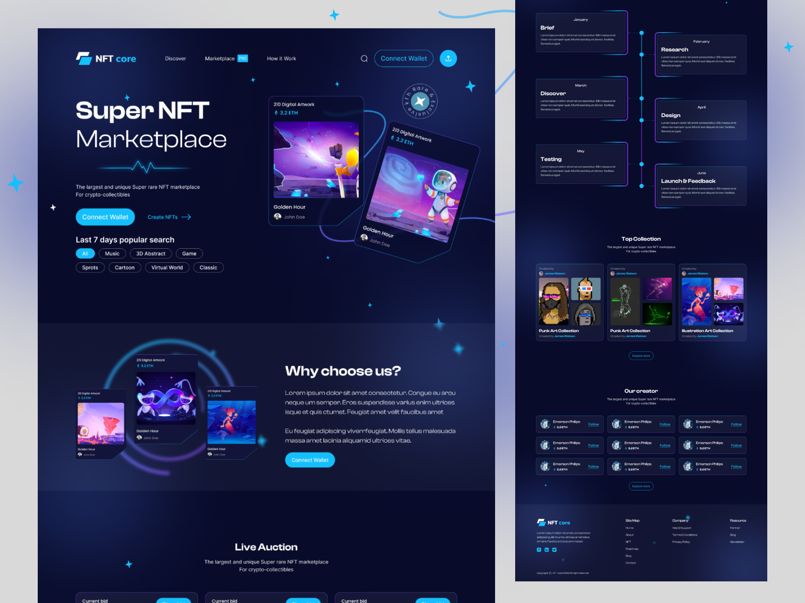

# SuperNFTLandong

## 🎬 Демонстрация проекта

  

## Технологии

Проект разработан с использованием следующих технологий:

- **HTML**: Для структуры и разметки страницы.
- **CSS/SCSS**: Для стилей и улучшенной возможности организации стилей с помощью Sass.
- **JavaScript (GSAP, ScrollTrigger, TimeLine)**: Для создания креативных анимаций и управления временем.

## Анимации и Эффекты

SuperNFT использует библиотеку GSAP для создания динамичных анимаций и ScrollTrigger для реагирования на прокрутку страницы. Вот несколько примеров:
